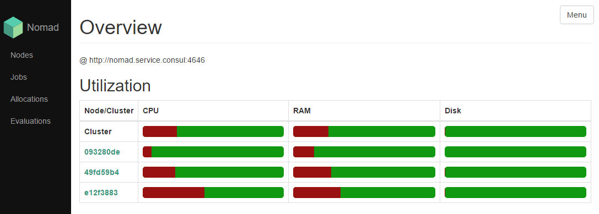
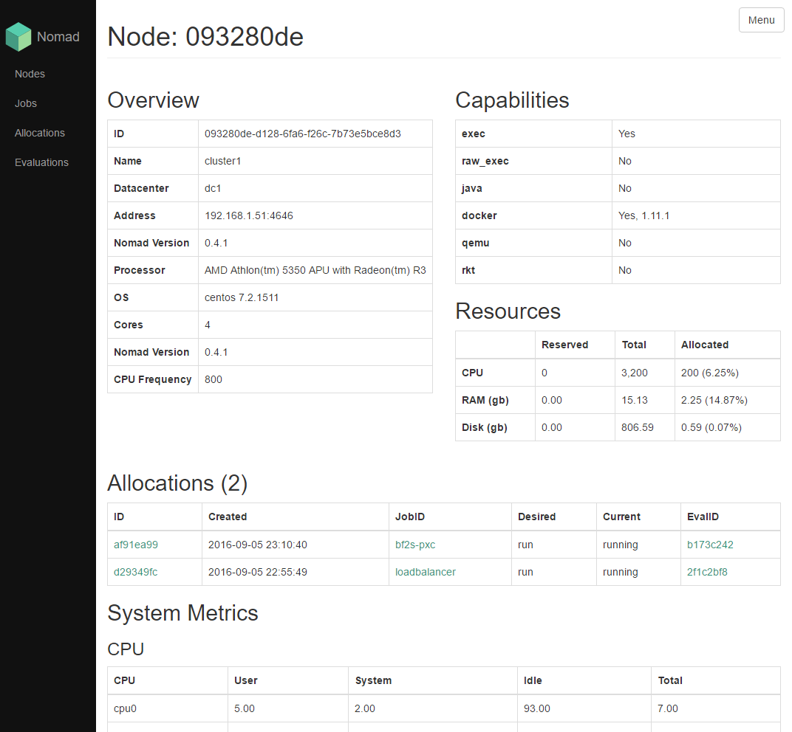
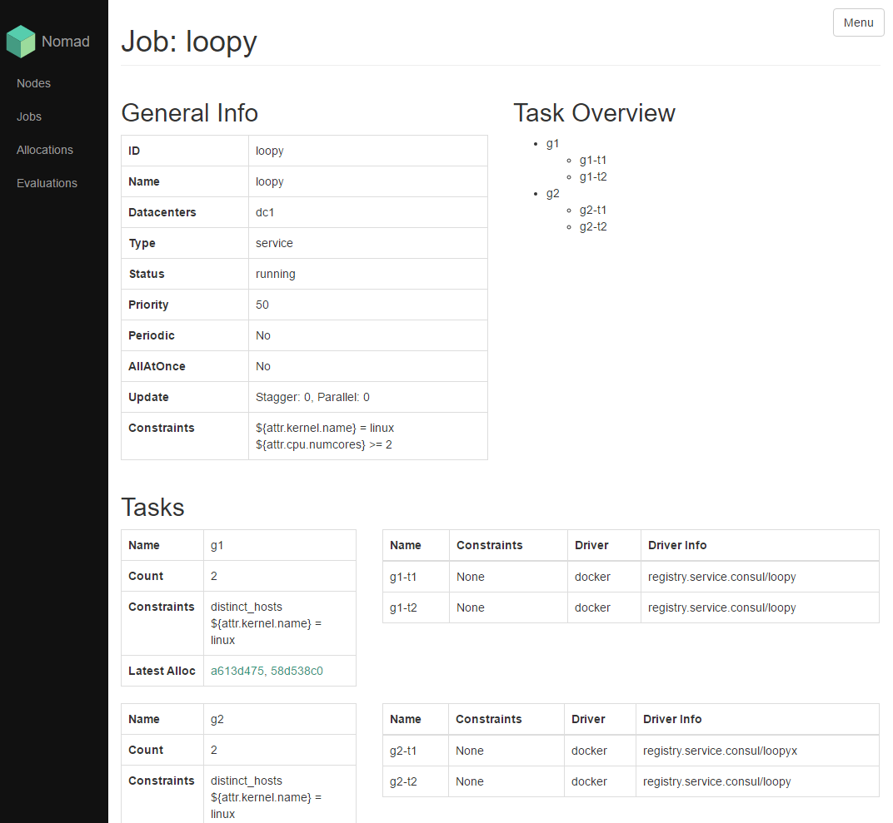
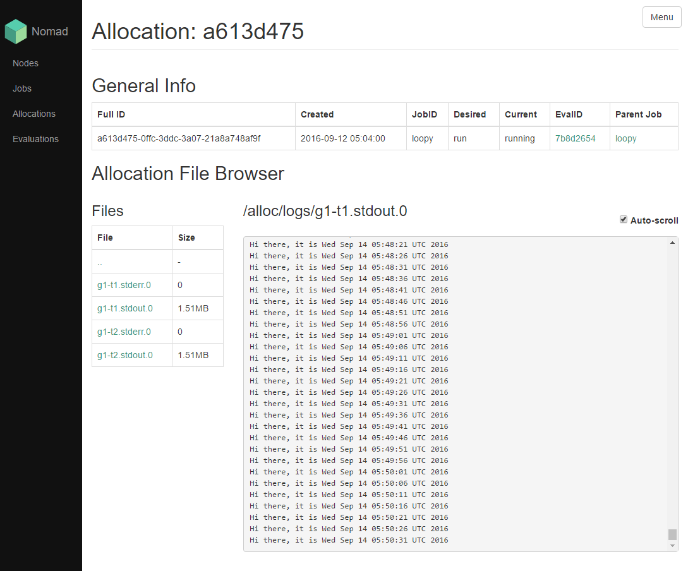

# Nomad UI

A basic, linkable, fast Nomad UI.

Feature List:

- [x] Overview index: Nodes, Jobs, Allocations, and Evaluations
- [x] Node details
- [x] Job details
- [ ] Evaluation details
- [x] Allocation details
- [x] Allocation File System Explorer
- [x] Allocation File Streamer

## Screenshots

Homepage:


Node:


Job:


Allocation (and file streamer):


## Run Nomad UI

Provide the Nomad URL and simple invoke the dockerhub hosted image:

```
docker run -ti --rm --name=nui \
 -p 8080:80 \
 -e 'NOMAD_BASEURL=http://nomad.service.consul:4646' \
 chuyskywalker/nomad-ui
```

`nomad-ui` will then be running in the foreground and is available at `http://<your-ip>:8080`.

## Development

Build the container, run composer to get dependencies, and then mount the git checkout over a new instance of the container:

```
docker build -t chuyskywalker/nomad-ui .
docker run -ti --rm -v $(pwd)/html:/app composer/composer install
docker run -ti --rm --name=nui-dev \
 -p 8080:80 \
 -e 'NOMAD_BASEURL=http://nomad.service.consul:4646' \
 -e 'NOMAD_TWIG_DEBUG=1' \
 -v `pwd`/html:/var/www/html \
 chuyskywalker/nomad-ui
```

Switch out `-ti --rm` with `-d` if you want it to run in the background more permanently.

Now just start editing the PHP, JS, CSS, etc and refresh your browser!
